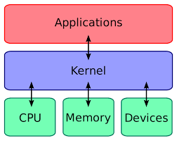

### Actividad 1
#### Tipos de Kernel, sus diferencias y User vs Kernel Mode

Antes de iniciar a responder las preguntas de la actividad, es necesario que definamos el tema central de la misma, **¿Qué es el Kernel?**

El kernel en pocas palabras es el corazón del sistema operativo, se encarga de comunicar el software y el hardware de nuestro equipo, además de la organización de los procesos y datos de cada equipo; Controla todos los accesos al procesador y a la memoria.

* **Funciones del kernel**
    * Gestión de memoria
    * Gestión de procesos
    * Controladores de dispositivos
    * Seguridad y llamadas al sistema
    * Protección
    * Gestión de dispositivos externos
    * Gestión de optimización

**1. Tipos de kernel y sus diferencias:**

* **Microkernel o micronúcleo**
    Ofrece funciones básicas de cada dispositivo. Son más compactos que otro tipo de núcleos, lo cual brinda beneficios en cuanto a portabilidad, seguridad y su capacidad para adaptarse. Sin embargo el rendimiento de la máquina puede verse afectado.
     
* **Núcleos Monolíticos**
    Gran núcleo informatico para todas las tareas del sistema. No es modular y puede alcanzar un mejor rendimiento que un microkernel. Para poder realizar alguna modificación es necesaria la compilación del núcleo y reiniciar el sistema. 
    El nucleo del sistema **Linux** es monolitico, por lo que los programas tienen mayor acceso al hardware, pero tiene dificultades a nivel de seguridad.
     
* **Núcleos Híbridos**
    Incluye codigo adicional para que se ejecuten labores más rápido. Permite elegir que acciones realizar en modo usuario y cuales en modo supervisor.

**2. User vs Kernel Mode:**
    Existen básicamente dos modos para el código de un sistema: **modo kernel** o **modo usuario**. El código en modo kernel tiene acceso ilimitado al hardware, mientras que el código en modo usuario tiene acceso restringido al SCI. Cuando se produce un error en el modo de usuario, no ocurre mucho: de hecho, en ese momento el kernel interviene y repara los posibles daños. Por otro lado, un fallo del kernel puede hacer caer todo el sistema. No obstante, existen precauciones de seguridad para evitarlo.

