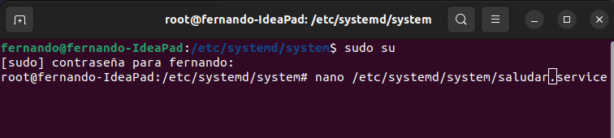
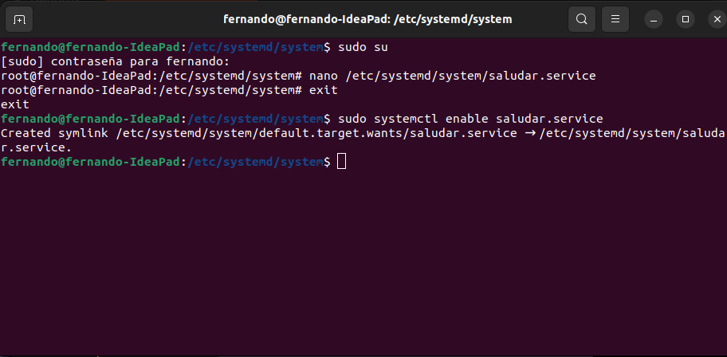
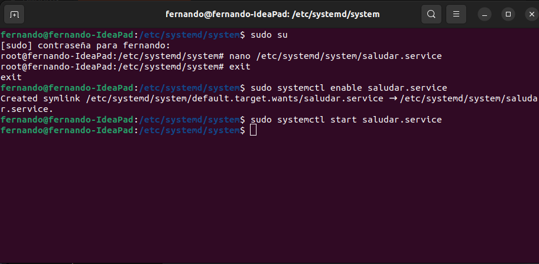
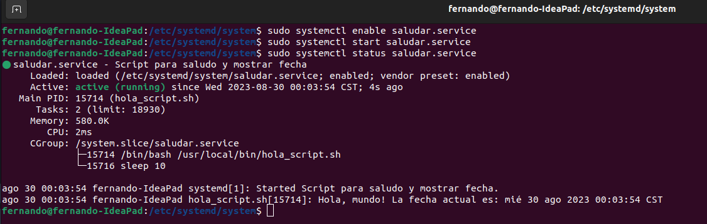

<Center>

## Actividad 4
### Creación de un system unit de tipo servicio

</Center>

- Paso 1: Crear el script

    - primero debemos de crear el script que vamos a ejecutar, lo llamaremos "Hola_script.sh"

    ```bash
    #!/bin/bash
    while true; do
    echo "Hola, mundo! La fecha actual es: $(date)"
    sleep 5
    done
    ```

- Paso 2: Crear archivo de unit service

    - Nos aseguramos de tener permisos de super usuario y creamos un archivo llamado saludar.service en el directorio /etc/systemd/system/ 

    

    ```service
    [Unit]
    Description=Script de saludo y fecha

    [Service]
    Type=simple
    ExecStart=/ruta/a/tu/saludo_script.sh

    [Install]
    WantedBy=default.target
    ```

- Paso 3: Verificar permisos
    - verificar que la carpeta donde colocamos nuestro archivo "hola_script.sh" tenga permisos de ejecución
    
    ```
    ls -l /Documentos/so1_actividades_201404106/actividad4/hola_script.sh
    ```
    - en caso de no tener los permisos de ejecución hay que otorgarlos:
    ```
    chmod +x /Documentos/so1_actividades_201404106/actividad4/hola_script.sh
    ```

- Paso 4: Habilitar y arrancar el servicio
    - Despues de haber creado el archivo de unit service 
    1. habilita el servicio para iniciar al arrancar el sistema:

    ```bash
    sudo systemctl enable saludar.service
    ```
    

    2. Iniciar el servicio

    ```bash
    sudo systemctl start saludar.service
    ```
    
    3. Verificar el estado del servicio:
    ```bash
    sudo systemctl status saludar.service
    ```
    